## HOL6284: Elasiticity of Oracle Java Cloud Service through Auto Scaling  ##

### Introduction ###
Scaling lets you add or remove resources for an Oracle Java Cloud Service instance on demand in response to changes in load on the service instance. You can scale an Oracle Java Cloud Service instance by scaling a cluster, a node, or the Coherence data tier in the service instance.
Oracle Java Cloud Service has Auto Scaling feature which allows you to define rule for a given service. When the rule's criteria meets the defined threshold Auto Scaling starts to scale in/out the service.

### About this tutorial ###
This tutorial demonstrates how to:

+ Create Auto Scaling rule

### Prerequisites ###

(ALL THESE SERVICESE WERE PRECREATED ALREADY BEFORE OOW FOR HOL PARTICIPANTS)

+ Oracle Public Cloud Services account including:
	+ Database Cloud Service
	+ Java Cloud Service
+ [Create Database Cloud Service Instance using user interface](../dbcs-create/README.md)
+ [Create Java Cloud Service Instance using user interface](../jcs-create/README.md)

### Steps ###

#### Build and Deploy Sample Load Generator Application ####

First you need to download the application which will generate load on the service instance's CPU. This is a simple Web Application which creates a large collection and repeatedly shuffle/order the elements in the list. Application load.war is [here](load.war), click on link and click download to store on local disk.

Now [sign in](../common/sign.in.to.oracle.cloud.md) to [https://cloud.oracle.com/sign_in](https://cloud.oracle.com) and on the Dashboard Page click the **Java Instances** link.
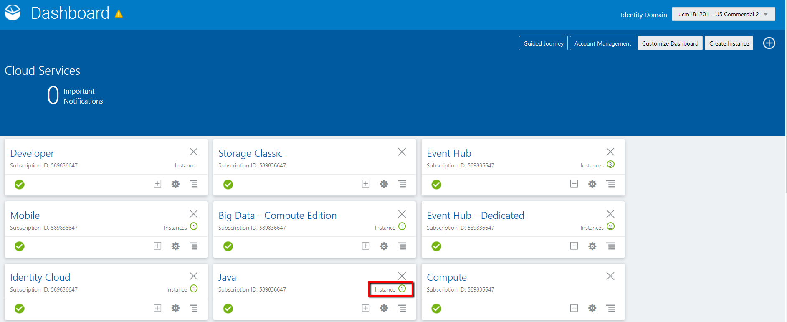

On the Console page select and click the Java Cloud Service name link where you want to deploy the Load Application.

Click the hamburger menu on the top right. Select **Open WebLogic Server Console**.
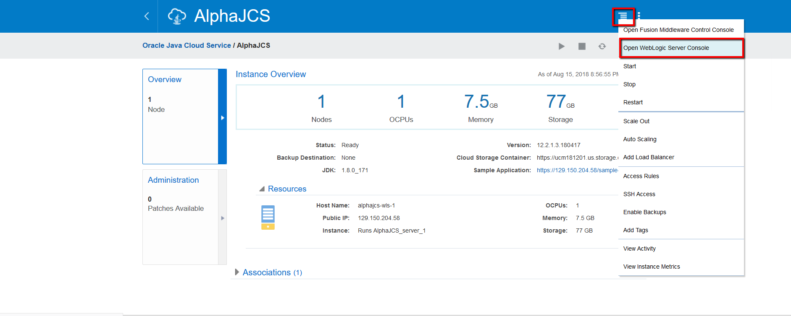

A new browser (tab) opens and you are redirected to the selected console’s log-in page. If the server is protected with a self-signed certificate, you will be warned that this certificate is not trusted. This is the default configuration and you can configure your certification. Select **I Understand the Risk**, and **Add Exception** (accept certificate). When dialog appears select **Confirm Security Exception**.

When the console log-in page appears, enter the log-in credentials you entered for WebLogic Administrator when you created the service instance. Click **Login**.
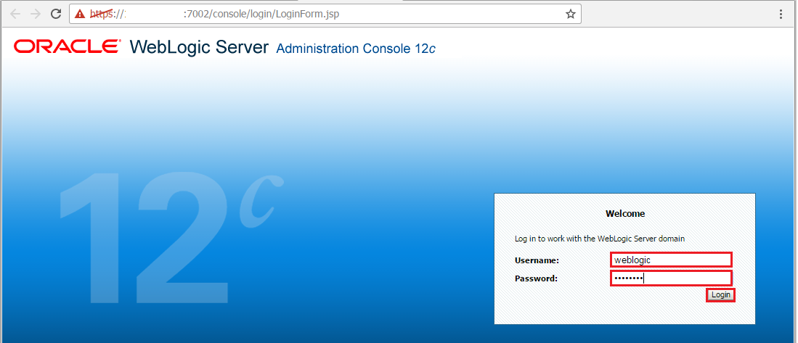

After a successful login the WebLogic Server Administration Console is displayed. On the left side in the navigation tree click **Deployments**. Then click **Lock & Edit** above and finally click the **Install** button.
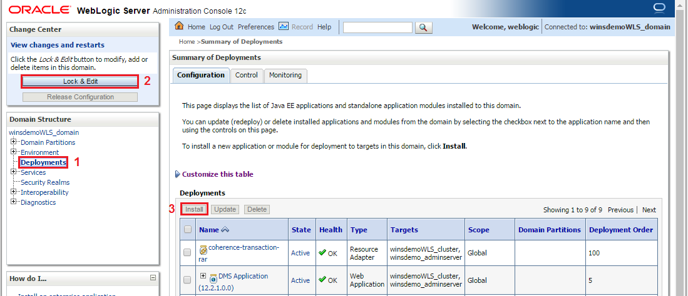

Now you need to click **Upload your file(s)** link because the WAR file not located on the server, hence it requires upload.
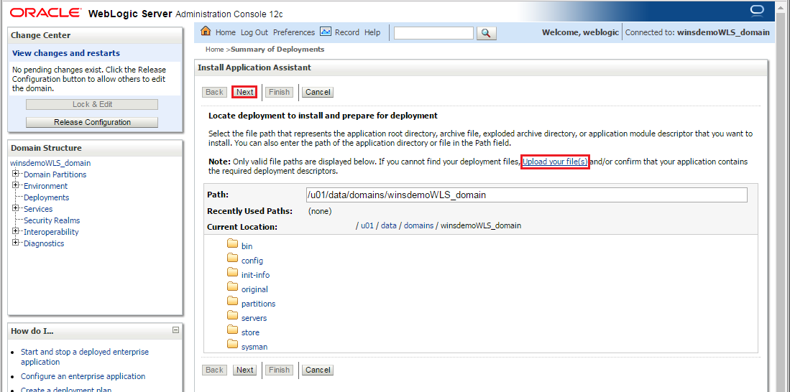

Click **Choose File** to open File Open dialog and select `load.war` from your local repository `/u01/content/HOL6284/load.war`.
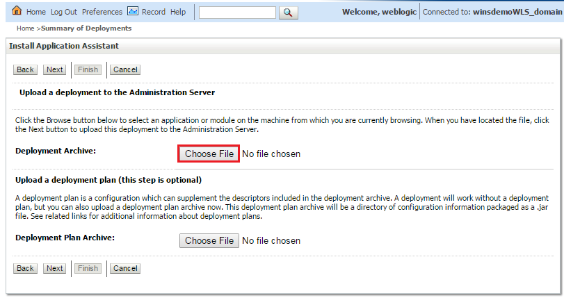

After the file is uploaded, its name appears next to the **Browse** button. Click **Next**.
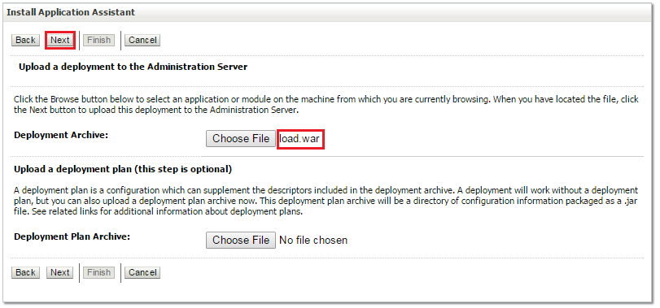

Confirm the selection of the `load.war` application archive and click **Next**.
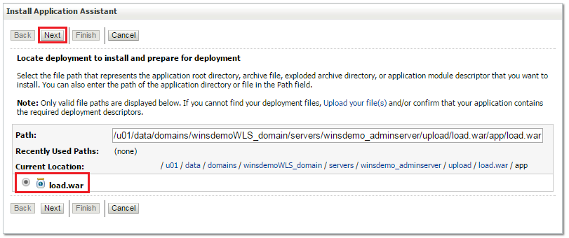

Make sure the installation type is Install this deployment as an application. Click **Next**.
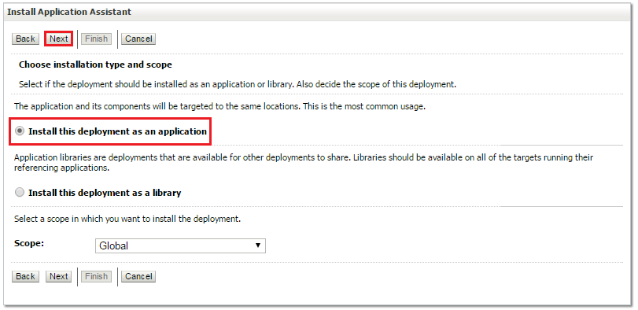

Choose to deploy the application to all the servers in the cluster, and then click **Next**.
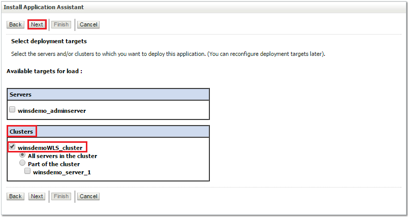

The default settings for Optional Settings are typically adequate so leave defaults. Click **Finish**.
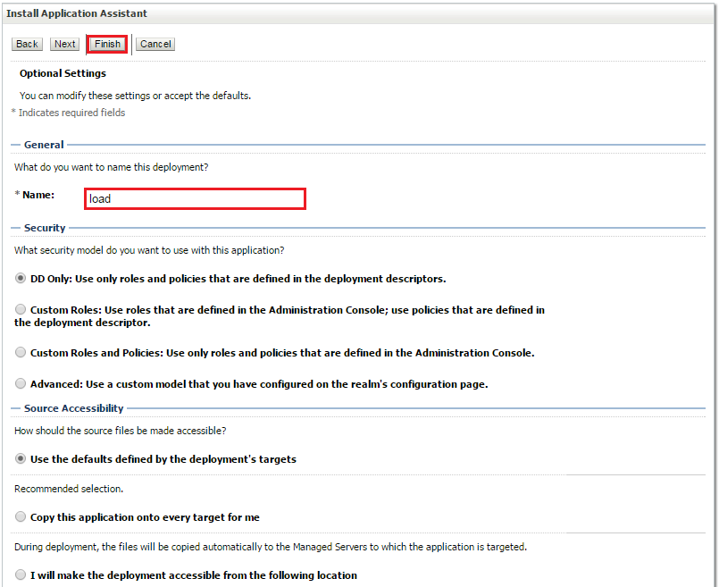

In the Change Center, click **Activate Changes**.
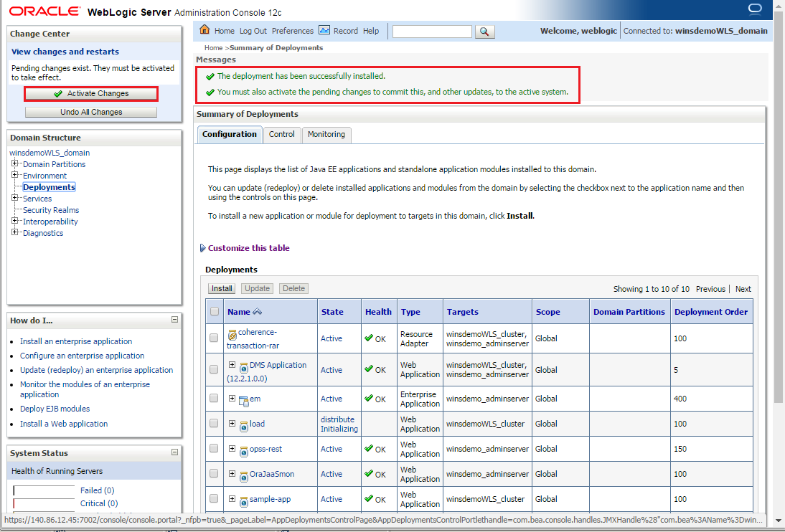

Now the application is in *Prepared* state and you need to make it ready to accept requests. To start a deployed application select *Deployments* in Domain Structure and click on **Control** Tab. The previously deployed application can be found in the list. Select the application, click **Start** and then select **Servicing all requests**.
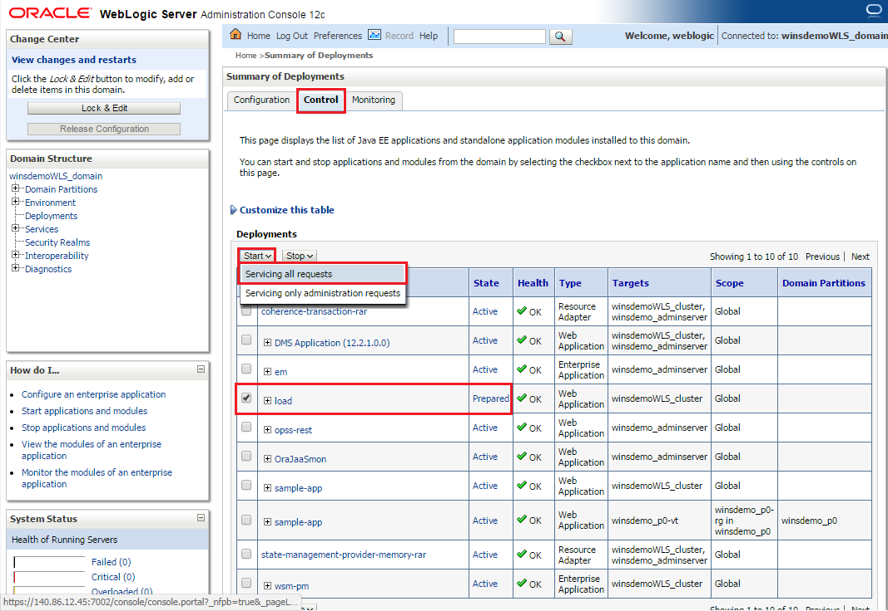

Click **Yes** to confirm the deployment.

The application is now in the *Active* state and is ready to accept requests.
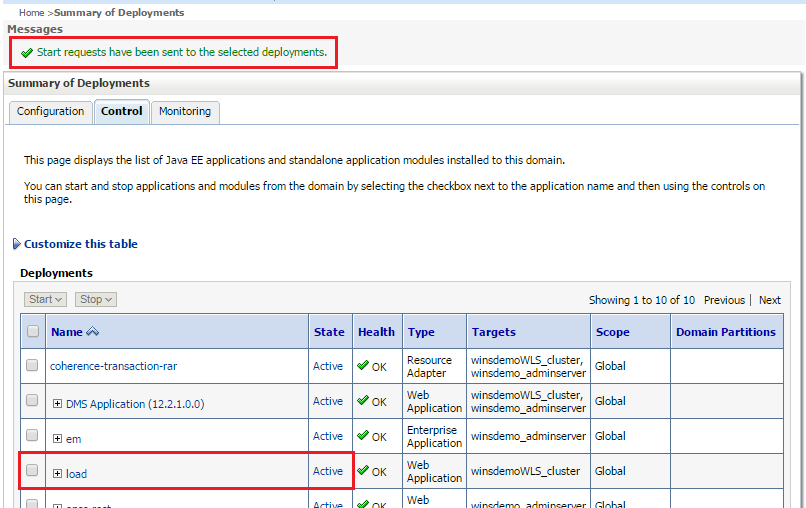

#### Launch the Sample Load Generator Application ####

To hit the application first you need to get more information about your Java Cloud Service  topology. You need to have a public IP address which belongs to your Load Balancer if that exists. Otherwise you need the IP address of the VM instance which runs one of your Managed Server.

Go back to the browser (tab) where you opened WebLogic console. That page is the Java Cloud Service details page where you can check the instance topology and the public IP addresses. Make sure that the **Overview** is selected on the left menu. If you have Load Balancer then use its IP address to hit the sample application. If you don't have Load Balancer then use IP address of VM which runs the Managed Server.
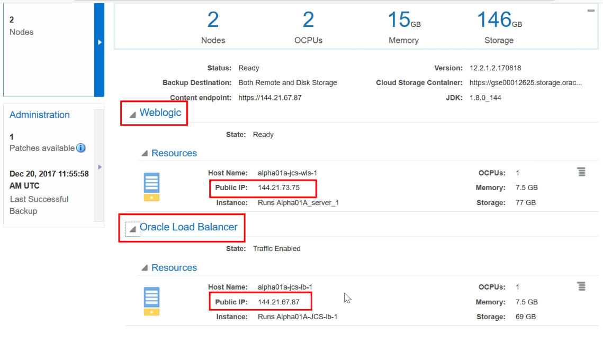

Open a browser and write the following URL: `https://<public-ip-address>/load/cpu.jsp` You should now see a simple application what will be used later for load generation.

#### Create Auto Scaling Rule ####

Create rule for Java Cloud Service which triggers auto scaling based on the defined criteria. Go back to the Java Cloud Service instance details page and click **Overview** on the left menu. Click **Add Node** and select **Auto Scaling** item.
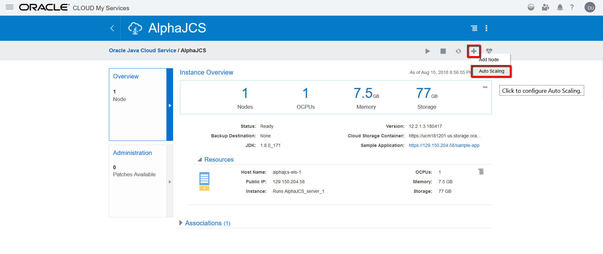

On the Rules page click **Create Rule**.

Define the rule parameters.

+ Perform: **Scale Out**
+ Maximum Cluster Size: **2** (1 more higher then the existing cluster size)
+ CPU Utilization: **Maximum** - **50%**
+ Number for measurement period: **1**
+ Period length: **5** minutes (this is the minimum)
+ VM instances: **Any**
+ Cool down period: 30 (this is the minimum)

Click **Create**.

Wait till the rule will be complete.
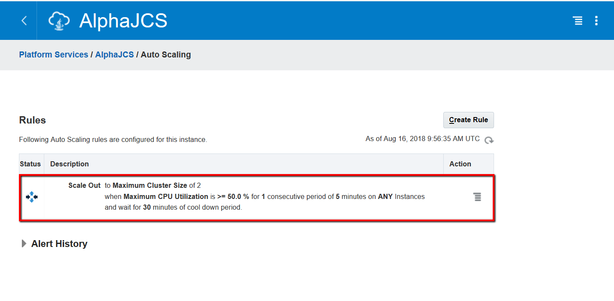

Before the load generation here is how you can check CPU load during the utilization. On the JCS console click on upper right icon `Display monitoring information`, and after short time CPU usage and free memory will be displayed. During load generation you can check few times cpu usage.
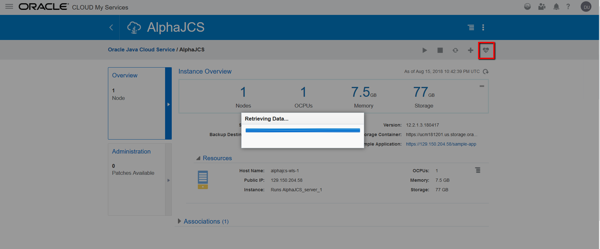

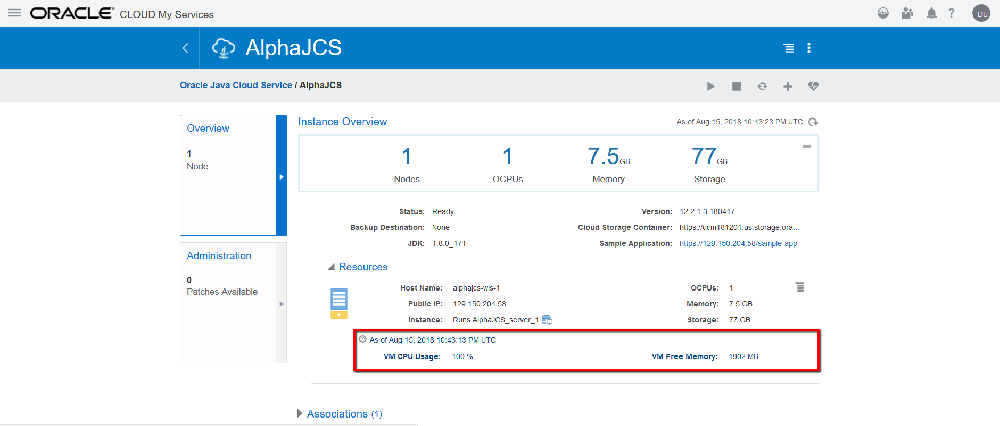

Another option to check cpu usage is by using REST API. Here is curl command that returns healthcheck monitoring data and metrics for the specified Oracle Java Cloud Service instance. In the event you encounter a status 500 error when attempting to retrieve data for your service instance, append the ?format=v4 query parameter and try again. Change appropriate values for your environment.

	curl -i -X GET -u USERNAME:PASSWORD -H "X-ID-TENANT-NAME:idcs-YOURID"
	https://jaas.oraclecloud.com/paas/api/v1.1/instancemgmt/idcs-YOURID/services/jaas/instances/YOURJCSINSTANCE/healthcheck

Here is the snippet of responses, look for "hostName":

	...
	  "hostName": "alphajcs-wls-1",
          "label": "AlphaJCS wls 1",
          "vmId": 1135097,
          "healthData": {
            "VMCpuUtil": {
              "unit": "%",
              "value": "100",
              "displayName": "VM CPU Usage"
            },
            "VMmemory": {
              "unit": "MB",
              "value": "1935",
              "displayName": "VM Free Memory"
            }
          },
          "statusMessage": "Running"
        }
      },
      ...

Again, durin the load yo can run health check command few times to check CPU load.

Now is the time to generate load for Java Cloud Service. Switch to the browser where the simple Load Generator Web Application was opened. Select `mid` load, enter 400000 milliseconds long run and click **Submit**.

Using one of the option you check the CPU utilization and wait till the Auto Scaling rule triggers scale out operation for Java Cloud Service. In that moment you will notice on JCS console that JCS instance is in maintenance mode and operational message on the bottom.
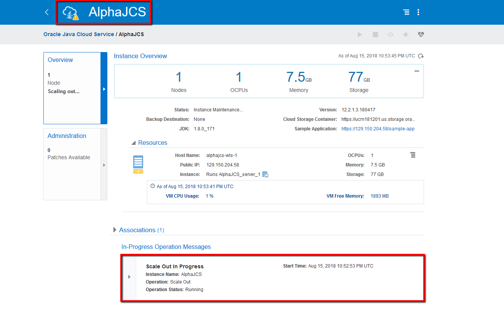

After scaling is finished you will see two node JCS instance.
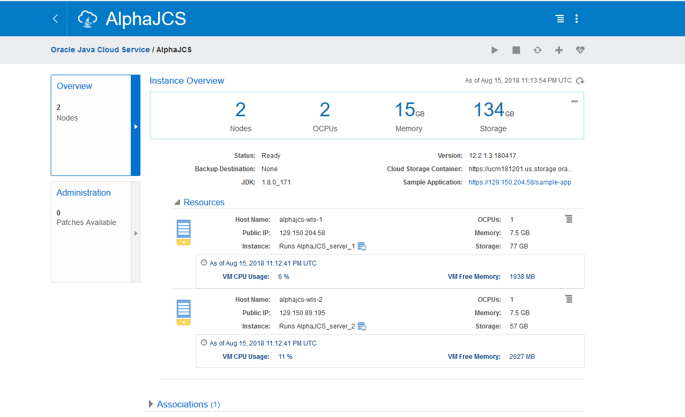
